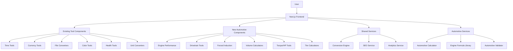

# Design Document

## Overview

The Automotive Converter Tools extension builds upon the existing InterConverter.com platform to provide specialized automotive calculations for mechanics, racers, and enthusiasts. The design maintains consistency with the existing platform while introducing automotive-specific components and calculations. The architecture leverages the established patterns from the main platform, extending the tool configuration system and adding new converter components specifically designed for automotive applications.

## Architecture

### Extended Architecture Diagram



### Technology Integration

The automotive tools will integrate with the existing technology stack:

- **Framework**: Next.js 14 with App Router (existing)
- **Styling**: Tailwind CSS with shadcn/ui components (existing)
- **New Components**: Automotive-specific input components and calculators
- **Validation**: Extended validation library for automotive parameters
- **Formulas**: New automotive calculation library with verified formulas
- **SEO**: Extended SEO service with automotive-specific meta tags

### Extended Directory Structure

```
src/
├── app/[locale]/
│   ├── (tools)/
│   │   ├── automotive/
│   │   │   ├── carburetor-cfm-calculator/
│   │   │   ├── compression-ratio-calculator/
│   │   │   ├── gear-ratio-calculator/
│   │   │   ├── supercharger-calculator/
│   │   │   ├── engine-displacement-calculator/
│   │   │   ├── torque-horsepower-calculator/
│   │   │   ├── tire-speed-calculator/
│   │   │   ├── volumetric-efficiency-calculator/
│   │   │   ├── power-to-weight-calculator/
│   │   │   └── fluid-weight-calculator/
│   │   └── [existing tools...]
├── components/
│   ├── automotive/
│   │   ├── AutomotiveLayout.tsx
│   │   ├── EngineInputs.tsx
│   │   ├── DrivetrainInputs.tsx
│   │   ├── PerformanceDisplay.tsx
│   │   └── EducationalTooltip.tsx
│   └── converters/
│       ├── automotive/
│       │   ├── CarburetorCFMCalculator.tsx
│       │   ├── CompressionRatioCalculator.tsx
│       │   ├── GearRatioCalculator.tsx
│       │   └── [other automotive calculators]
├── lib/
│   ├── automotive/
│   │   ├── engine-formulas.ts
│   │   ├── drivetrain-calculations.ts
│   │   ├── forced-induction.ts
│   │   └── automotive-validators.ts
└── types/
    └── automotive.ts
```

## Components and Interfaces

### Core Automotive Components

#### 1. AutomotiveLayout Component
Specialized layout for automotive tools with automotive-specific branding and context:

```typescript
interface AutomotiveLayoutProps {
  title: string;
  description: string;
  children: React.ReactNode;
  toolId: string;
  category: 'engine' | 'drivetrain' | 'performance' | 'fluids';
  educationalContent?: EducationalContent;
  safetyWarnings?: string[];
}

interface EducationalContent {
  theory: string;
  applications: string[];
  tips: string[];
  relatedTools: string[];
}
```

#### 2. EngineInputs Component
Reusable input component for common engine parameters:

```typescript
interface EngineInputsProps {
  onValuesChange: (values: EngineParameters) => void;
  requiredFields: (keyof EngineParameters)[];
  units: 'metric' | 'imperial';
  showAdvanced?: boolean;
}

interface EngineParameters {
  displacement?: number; // CI or Liters
  bore?: number; // inches or mm
  stroke?: number; // inches or mm
  cylinders?: number;
  compressionRatio?: number;
  horsepower?: number;
  torque?: number;
  rpm?: number;
}
```

#### 3. PerformanceDisplay Component
Standardized display for automotive calculation results:

```typescript
interface PerformanceDisplayProps {
  results: AutomotiveResult[];
  recommendations?: Recommendation[];
  warnings?: Warning[];
  showComparisons?: boolean;
}

interface AutomotiveResult {
  label: string;
  value: number | string;
  unit: string;
  precision: number;
  category: 'primary' | 'secondary' | 'derived';
}

interface Recommendation {
  type: 'performance' | 'safety' | 'tuning';
  message: string;
  priority: 'high' | 'medium' | 'low';
}
```

#### 4. EducationalTooltip Component
Interactive tooltips for automotive education:

```typescript
interface EducationalTooltipProps {
  term: string;
  definition: string;
  examples?: string[];
  relatedTerms?: string[];
  position: 'top' | 'bottom' | 'left' | 'right';
}
```

### Automotive Calculator Components

#### 1. CarburetorCFMCalculator
```typescript
interface CarburetorCFMCalculatorProps {
  engineType: 'stock' | 'street-strip';
  onCalculate: (result: CFMResult) => void;
}

interface CFMResult {
  cfm: number;
  engineType: string;
  displacement: number;
  unit: 'ci' | 'liters';
  recommendations: string[];
}
```

#### 2. CompressionRatioCalculator
```typescript
interface CompressionRatioCalculatorProps {
  onCalculate: (result: CompressionResult) => void;
}

interface CompressionResult {
  hpPercentChange: number;
  hpChange: number;
  newHorsepower: number;
  originalCR: number;
  newCR: number;
  warnings: string[];
}
```

#### 3. GearRatioCalculator
```typescript
interface GearRatioCalculatorProps {
  calculationType: 'teeth-count' | 'speed-rpm' | 'ideal-ratio';
  onCalculate: (result: GearRatioResult) => void;
}

interface GearRatioResult {
  ratio: number;
  calculationType: string;
  inputs: Record<string, number>;
  applications: string[];
  recommendations: string[];
}
```

## Data Models

### Automotive Tool Configuration

```typescript
interface AutomotiveToolConfig extends ToolConfig {
  category: 'automotive';
  subcategory: 'engine' | 'drivetrain' | 'performance' | 'fluids';
  difficulty: 'beginner' | 'intermediate' | 'advanced';
  safetyLevel: 'low' | 'medium' | 'high';
  educationalContent: EducationalContent;
  relatedTools: string[];
  popularityScore: number;
}
```

### Automotive Calculation Results

```typescript
interface AutomotiveCalculationResult<T> {
  success: boolean;
  result?: T;
  error?: string;
  warnings: Warning[];
  recommendations: Recommendation[];
  metadata: {
    timestamp: Date;
    formula: string;
    inputs: Record<string, any>;
    accuracy: 'high' | 'medium' | 'estimated';
  };
}
```

### Engine Specifications

```typescript
interface EngineSpec {
  displacement: {
    ci: number;
    liters: number;
  };
  bore: number;
  stroke: number;
  cylinders: number;
  compressionRatio: number;
  valvesPerCylinder?: number;
  fuelSystem?: 'carbureted' | 'fuel-injected';
  aspiration?: 'naturally-aspirated' | 'turbocharged' | 'supercharged';
}
```

### Drivetrain Configuration

```typescript
interface DrivetrainConfig {
  transmission: {
    type: 'manual' | 'automatic';
    gearRatios: number[];
    finalDrive: number;
  };
  differential: {
    ratio: number;
    type: 'open' | 'limited-slip' | 'locking';
  };
  tires: {
    diameter: number;
    width: number;
    sidewallRatio: number;
  };
}
```

## Automotive Formula Library

### Engine Performance Formulas

```typescript
class EngineFormulas {
  // Carburetor CFM calculation
  static calculateCFM(displacement: number, engineType: 'stock' | 'street-strip'): number {
    const multiplier = engineType === 'stock' ? 1.618 : 1.76;
    return displacement * multiplier;
  }

  // Compression ratio horsepower change
  static calculateCompressionHPChange(
    currentHP: number, 
    currentCR: number, 
    newCR: number
  ): CompressionResult {
    const hpPercentChange = ((1 - (1 / Math.pow(newCR, 0.4))) / 
                            (1 - (1 / Math.pow(currentCR, 0.4)))) - 1;
    const hpChange = hpPercentChange * currentHP;
    const newHorsepower = currentHP + hpChange;
    
    return {
      hpPercentChange: hpPercentChange * 100,
      hpChange,
      newHorsepower,
      originalCR: currentCR,
      newCR,
      warnings: this.getCompressionWarnings(newCR)
    };
  }

  // Supercharger horsepower gain
  static calculateSuperchargerGain(baseHP: number, psi: number): number {
    return (baseHP * psi) / 14.696;
  }

  // Volumetric efficiency calculation
  static calculateVE(hp: number, displacement: number, rpm: number): number {
    return (9411 * hp * 0.45) / (displacement * rpm);
  }

  // Torque and horsepower relationships
  static calculateTorque(hp: number, rpm: number): number {
    return (hp * 5252) / rpm;
  }

  static calculateHorsepower(torque: number, rpm: number): number {
    return (torque * rpm) / 5252;
  }

  static calculateRPM(hp: number, torque: number): number {
    return (hp * 5252) / torque;
  }
}
```

### Drivetrain Calculations

```typescript
class DrivetrainFormulas {
  // Gear ratio from teeth count
  static calculateGearRatio(ringTeeth: number, pinionTeeth: number): number {
    return ringTeeth / pinionTeeth;
  }

  // Current gear ratio from speed and RPM
  static calculateCurrentRatio(mph: number, rpm: number, tireDiameter: number): number {
    return (rpm * tireDiameter) / (mph * 336);
  }

  // Vehicle speed calculation
  static calculateSpeed(rpm: number, gearRatio: number, tireDiameter: number): number {
    return (rpm * tireDiameter) / (gearRatio * 336);
  }

  // Tire revolutions per mile
  static calculateTireRPM(tireDiameter: number): number {
    return 5280 / ((tireDiameter / 12) * Math.PI);
  }

  // Speed change from tire size change
  static calculateSpeedChange(
    currentDiameter: number,
    newDiameter: number,
    gearRatio: number,
    rpm: number
  ): number {
    return (rpm * (newDiameter - currentDiameter)) / (gearRatio * 336);
  }
}
```

### Fluid Weight Calculations

```typescript
class FluidCalculations {
  private static readonly FLUID_DENSITIES = {
    gasoline: 6.073, // lbs per gallon
    motorOil: 7.35,
    transmissionFluid: 7.4,
    water: 8.34
  };

  static calculateFluidWeight(gallons: number, fluidType: keyof typeof FluidCalculations.FLUID_DENSITIES): number {
    return gallons * this.FLUID_DENSITIES[fluidType];
  }

  static calculateFluidVolume(pounds: number, fluidType: keyof typeof FluidCalculations.FLUID_DENSITIES): number {
    return pounds / this.FLUID_DENSITIES[fluidType];
  }
}
```

## Error Handling and Validation

### Automotive-Specific Validation

```typescript
class AutomotiveValidator {
  static validateEngineDisplacement(displacement: number, unit: 'ci' | 'liters'): ValidationResult {
    const limits = unit === 'ci' ? { min: 50, max: 1000 } : { min: 0.8, max: 16.4 };
    
    if (displacement < limits.min || displacement > limits.max) {
      return {
        isValid: false,
        error: `Engine displacement must be between ${limits.min} and ${limits.max} ${unit}`
      };
    }
    
    return { isValid: true };
  }

  static validateCompressionRatio(cr: number): ValidationResult {
    if (cr < 6 || cr > 20) {
      return {
        isValid: false,
        error: 'Compression ratio must be between 6:1 and 20:1',
        warning: cr > 12 ? 'High compression ratios may require premium fuel' : undefined
      };
    }
    
    return { isValid: true };
  }

  static validateRPM(rpm: number, engineType: 'stock' | 'modified'): ValidationResult {
    const maxRPM = engineType === 'stock' ? 7000 : 10000;
    
    if (rpm < 500 || rpm > maxRPM) {
      return {
        isValid: false,
        error: `RPM must be between 500 and ${maxRPM} for ${engineType} engines`
      };
    }
    
    return { isValid: true };
  }
}

interface ValidationResult {
  isValid: boolean;
  error?: string;
  warning?: string;
}
```

## Testing Strategy

### Automotive-Specific Testing

#### 1. Formula Accuracy Testing
```typescript
describe('Engine Formulas', () => {
  test('CFM calculation matches known values', () => {
    expect(EngineFormulas.calculateCFM(350, 'stock')).toBeCloseTo(566.3, 1);
    expect(EngineFormulas.calculateCFM(350, 'street-strip')).toBeCloseTo(616, 1);
  });

  test('Compression ratio HP calculation', () => {
    const result = EngineFormulas.calculateCompressionHPChange(300, 9.0, 10.0);
    expect(result.hpPercentChange).toBeGreaterThan(0);
    expect(result.newHorsepower).toBeGreaterThan(300);
  });
});
```

#### 2. Validation Testing
```typescript
describe('Automotive Validation', () => {
  test('validates engine displacement ranges', () => {
    expect(AutomotiveValidator.validateEngineDisplacement(350, 'ci').isValid).toBe(true);
    expect(AutomotiveValidator.validateEngineDisplacement(25, 'ci').isValid).toBe(false);
  });
});
```

#### 3. Component Integration Testing
- Test automotive calculator components with various input combinations
- Verify educational tooltips display correct information
- Test responsive design on mobile devices for automotive tools

## SEO Optimization for Automotive Tools

### Automotive-Specific SEO Strategy

#### 1. Keyword Targeting
- Primary: "carburetor cfm calculator", "gear ratio calculator", "compression ratio calculator"
- Long-tail: "how to calculate carburetor cfm for 350 engine", "supercharger horsepower gain calculator"
- Local: "automotive calculator tools", "engine tuning calculators"

#### 2. Structured Data for Automotive Tools
```json
{
  "@context": "https://schema.org",
  "@type": "SoftwareApplication",
  "name": "Carburetor CFM Calculator",
  "applicationCategory": "AutomotiveApplication",
  "description": "Calculate the correct carburetor CFM for your engine based on displacement and modification level",
  "operatingSystem": "Web Browser",
  "offers": {
    "@type": "Offer",
    "price": "0",
    "priceCurrency": "USD"
  },
  "featureList": [
    "Stock engine CFM calculation",
    "Modified engine CFM calculation",
    "Cubic inch to liter conversion",
    "Carburetor recommendations"
  ]
}
```

#### 3. Content Strategy
- Tool-specific landing pages with comprehensive explanations
- How-to guides for each automotive calculation
- Comparison tables for different engine configurations
- FAQ sections addressing common automotive questions

## Performance Considerations

### Automotive Tool Optimization

#### 1. Calculation Performance
- Memoize complex formula results
- Use Web Workers for intensive calculations
- Implement progressive calculation for real-time updates

#### 2. Educational Content Loading
- Lazy load educational tooltips and help content
- Cache frequently accessed automotive reference data
- Optimize images and diagrams for automotive content

#### 3. Mobile Optimization
- Touch-friendly input controls for automotive parameters
- Simplified interfaces for mobile automotive calculations
- Offline capability for basic automotive formulas

## Security and Safety Considerations

### Automotive-Specific Safety

#### 1. Calculation Disclaimers
- Clear warnings about the limitations of calculations
- Disclaimers about professional consultation for engine modifications
- Safety warnings for high-performance modifications

#### 2. Input Validation
- Strict validation of automotive parameters to prevent dangerous configurations
- Warnings for extreme values that could damage engines
- Educational content about safe operating ranges

#### 3. Professional Recommendations
- Encourage professional consultation for major modifications
- Provide links to automotive professionals and resources
- Include safety guidelines for automotive work

## Integration with Existing Platform

### Seamless Platform Integration

#### 1. Design Consistency
- Use existing design system with automotive-specific enhancements
- Maintain consistent navigation and user experience
- Integrate with existing search and categorization systems

#### 2. Analytics Integration
- Track automotive tool usage with existing analytics
- Monitor popular automotive calculations
- A/B test automotive-specific features

#### 3. Internationalization
- Extend existing i18n system for automotive terms
- Support metric and imperial units consistently
- Localize automotive educational content

This design provides a comprehensive foundation for implementing the automotive converter tools while maintaining consistency with the existing platform and ensuring high-quality user experience for automotive enthusiasts and professionals.