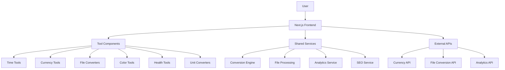

# Design Document

## Overview

InterConverter.com is designed as a scalable, SEO-optimized conversion tools platform built on Next.js 14 with internationalization support. The architecture follows a modular approach where each conversion tool is implemented as a separate page with shared components and utilities. The platform leverages the existing Next.js App Router structure with locale-based routing and implements a consistent design system for all conversion tools.

## Architecture

### High-Level Architecture



### Technology Stack

- **Frontend Framework**: Next.js 14 with App Router
- **Styling**: Tailwind CSS with shadcn/ui components
- **Internationalization**: next-intl for multi-language support
- **State Management**: React hooks and context for local state
- **File Processing**: Client-side processing with Web APIs where possible
- **External APIs**: Exchange rates API, file conversion services
- **Analytics**: Google Analytics 4 for usage tracking
- **Deployment**: Vercel or similar edge deployment platform

### Directory Structure

```
src/
├── app/[locale]/
│   ├── tools/
│   │   ├── timestamp-converter/
│   │   ├── currency-converter/
│   │   ├── loan-calculator/
│   │   ├── pdf-to-word/
│   │   ├── jpg-to-png/
│   │   ├── hex-to-rgb/
│   │   ├── bmi-calculator/
│   │   ├── unit-converter/
│   │   ├── countdown-timer/
│   │   └── tax-calculator/
│   └── page.tsx (homepage)
├── components/
│   ├── tools/
│   │   ├── ToolLayout.tsx
│   │   ├── ToolCard.tsx
│   │   └── ToolSearch.tsx
│   └── converters/
│       ├── TimeConverter.tsx
│       ├── CurrencyConverter.tsx
│       └── [other converters]
├── lib/
│   ├── converters/
│   ├── validators/
│   ├── api-clients/
│   └── analytics/
└── types/
    └── tools.ts
```

## Components and Interfaces

### Core Components

#### 1. ToolLayout Component
A standardized layout wrapper for all conversion tools that provides:
- Consistent header with tool title and description
- SEO meta tags generation
- Analytics tracking
- Error boundary handling
- Responsive design structure

```typescript
interface ToolLayoutProps {
  title: string;
  description: string;
  children: React.ReactNode;
  toolId: string;
  keywords?: string[];
}
```

#### 2. ToolCard Component
Reusable card component for displaying tools on the homepage and category pages:

```typescript
interface ToolCardProps {
  title: string;
  description: string;
  href: string;
  category: string;
  icon?: React.ReactNode;
  isPopular?: boolean;
}
```

#### 3. ConversionEngine Service
Central service for handling all conversion logic:

```typescript
interface ConversionEngine {
  convertTimestamp(timestamp: number, timezone?: string): Date;
  convertCurrency(amount: number, from: string, to: string): Promise<number>;
  convertUnits(value: number, fromUnit: string, toUnit: string, category: string): number;
  convertColor(value: string, fromFormat: string, toFormat: string): string;
}
```

### Tool-Specific Components

#### 1. TimestampConverter
- Input field for timestamp or date
- Timezone selector
- Real-time conversion display
- Copy to clipboard functionality

#### 2. CurrencyConverter
- Currency selection dropdowns
- Amount input with validation
- Real-time rate display
- Historical rate charts (future enhancement)

#### 3. FileConverter
- Drag-and-drop file upload
- Progress indicator
- Download link generation
- File size and format validation

#### 4. ColorConverter
- Color input (hex, rgb, color picker)
- Visual color preview
- Multiple format output
- Color palette suggestions

## Data Models

### Tool Configuration

```typescript
interface ToolConfig {
  id: string;
  name: string;
  description: string;
  category: string;
  keywords: string[];
  path: string;
  isActive: boolean;
  searchVolume?: number;
  difficulty?: number;
}
```

### Conversion Result

```typescript
interface ConversionResult<T> {
  success: boolean;
  result?: T;
  error?: string;
  metadata?: {
    timestamp: Date;
    source?: string;
    accuracy?: number;
  };
}
```

### User Analytics

```typescript
interface ToolUsage {
  toolId: string;
  sessionId: string;
  timestamp: Date;
  conversionCount: number;
  userAgent: string;
  locale: string;
}
```

## Error Handling

### Error Types

1. **Validation Errors**: Invalid input format or values
2. **API Errors**: External service failures (currency rates, file conversion)
3. **Processing Errors**: Client-side calculation or conversion failures
4. **Network Errors**: Connectivity issues

### Error Handling Strategy

```typescript
interface ErrorHandler {
  handleValidationError(error: ValidationError): UserFriendlyMessage;
  handleAPIError(error: APIError): UserFriendlyMessage;
  handleProcessingError(error: ProcessingError): UserFriendlyMessage;
  logError(error: Error, context: ErrorContext): void;
}
```

### User Experience for Errors

- Clear, actionable error messages
- Fallback options when external services fail
- Graceful degradation for non-critical features
- Retry mechanisms for transient failures

## Testing Strategy

### Unit Testing
- Individual converter functions
- Validation logic
- Utility functions
- Component rendering

### Integration Testing
- API integrations
- File upload/download flows
- Cross-browser compatibility
- Mobile responsiveness

### End-to-End Testing
- Complete user workflows
- SEO meta tag generation
- Analytics tracking
- Performance benchmarks

### Testing Tools
- Jest for unit tests
- React Testing Library for component tests
- Playwright for E2E tests
- Lighthouse for performance testing

## SEO Optimization

### Technical SEO

1. **URL Structure**: Clean, descriptive URLs for each tool
   - `/tools/timestamp-converter`
   - `/tools/currency-converter`
   - `/tools/bmi-calculator`

2. **Meta Tags**: Dynamic generation based on tool configuration
   ```typescript
   interface SEOConfig {
     title: string;
     description: string;
     keywords: string[];
     canonicalUrl: string;
     structuredData: StructuredData;
   }
   ```

3. **Structured Data**: JSON-LD markup for rich snippets
   - WebApplication schema
   - SoftwareApplication schema
   - HowTo schema for complex tools

### Content SEO

1. **Tool Descriptions**: Comprehensive, keyword-rich descriptions
2. **Usage Examples**: Step-by-step guides for each tool
3. **FAQ Sections**: Common questions and answers
4. **Related Tools**: Cross-linking between similar tools

### Performance SEO

1. **Core Web Vitals**: Optimize for LCP, FID, and CLS
2. **Image Optimization**: Next.js Image component with proper sizing
3. **Code Splitting**: Lazy loading for tool-specific components
4. **Caching Strategy**: Static generation with ISR for dynamic content

## Internationalization

### Supported Languages
- English (primary)
- Chinese (existing support)
- Spanish (future)
- French (future)

### Translation Strategy
- Tool names and descriptions
- Error messages
- Help text and instructions
- SEO meta content

### Implementation
```typescript
interface ToolTranslations {
  [locale: string]: {
    title: string;
    description: string;
    placeholder: string;
    buttons: Record<string, string>;
    errors: Record<string, string>;
  };
}
```

## Performance Considerations

### Client-Side Optimization
- Lazy loading of tool components
- Debounced input handling for real-time conversions
- Memoization of expensive calculations
- Service worker for offline functionality

### Server-Side Optimization
- Static generation for tool pages
- API route optimization
- CDN integration for static assets
- Database query optimization

### Monitoring
- Real User Monitoring (RUM)
- Core Web Vitals tracking
- API response time monitoring
- Error rate tracking

## Security Considerations

### Input Validation
- Sanitization of all user inputs
- File type and size validation
- Rate limiting for API calls
- CSRF protection

### Data Privacy
- No persistent storage of user data
- Temporary file cleanup
- GDPR compliance for analytics
- Cookie consent management

### API Security
- API key management
- Request authentication
- Rate limiting
- Input sanitization

## Scalability Plan

### Phase 1: Core 10 Tools
- Implement the initial high-traffic tools
- Establish the architecture and patterns
- Optimize for performance and SEO

### Phase 2: Category Expansion
- Add 20-30 additional tools
- Implement advanced features (history, favorites)
- Add user accounts and preferences

### Phase 3: Platform Features
- API access for developers
- Bulk conversion capabilities
- Advanced analytics dashboard
- White-label solutions