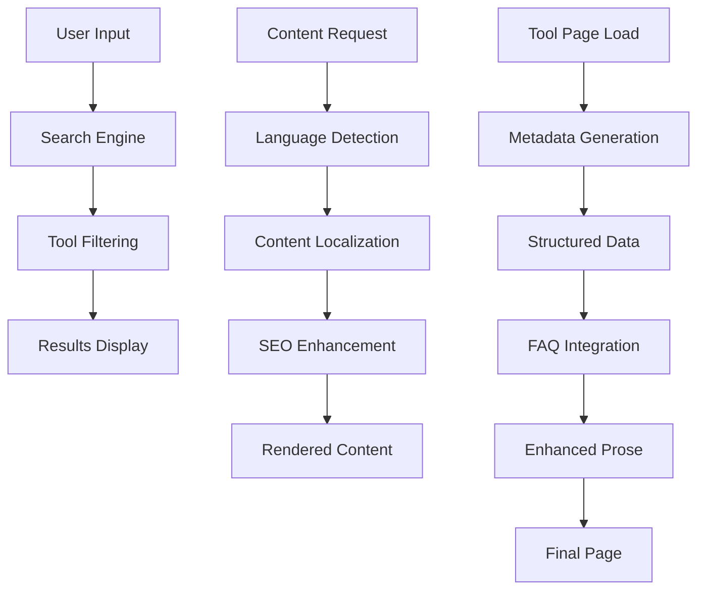

# Design Document

## Overview

This design document outlines the comprehensive UX enhancement strategy for InterConverter (interconverter.com), a professional tools platform. The solution addresses six key areas: search functionality improvements, visual design enhancement, content enrichment, multi-language management, prose styling, and SEO optimization. The design follows a modular, scalable approach that maintains the existing Next.js architecture while introducing modern UI patterns and improved user experience.

## Architecture

### Component Architecture

The enhancement follows a layered component architecture:

```
├── Enhanced Search System
│   ├── SearchInput (Homepage) - Real-time search with suggestions
│   ├── ToolSearch (Tools page) - Advanced filtering and search
│   └── SearchProvider - Centralized search state management
│
├── Visual Enhancement Layer
│   ├── ModernToolCard - Enhanced tool cards with animations
│   ├── CategorySection - Improved category organization
│   ├── ToolsPageLayout - New responsive layout system
│   └── AnimationProvider - Smooth transitions and micro-interactions
│
├── Content Management System
│   ├── SEOContentGenerator - Dynamic SEO content creation
│   ├── FAQProvider - Centralized FAQ management
│   ├── ToolDescriptionEngine - Rich tool descriptions
│   └── KeywordOptimizer - SEO keyword integration
│
├── Multi-language Enhancement
│   ├── LanguageProvider - Enhanced language management
│   ├── TranslationEngine - Scalable translation system
│   ├── LocaleRouter - Improved routing with language context
│   └── ContentLocalizer - Dynamic content localization
│
└── Styling System
    ├── ProseEnhancer - Modern typography and spacing
    ├── ThemeProvider - Enhanced dark/light mode support
    ├── ResponsiveLayout - Mobile-first responsive design
    └── AccessibilityEnhancer - WCAG compliance improvements
```

### Data Flow Architecture



## Components and Interfaces

### Enhanced Search System

#### SearchInput Component (Homepage)
```typescript
interface SearchInputProps {
  placeholder?: string;
  onSearch: (query: string) => void;
  suggestions: ToolSuggestion[];
  showSuggestions: boolean;
  locale: string;
}

interface ToolSuggestion {
  id: string;
  name: string;
  path: string;
  category: string;
  icon: string;
  relevanceScore: number;
}
```

**Features:**
- Real-time search suggestions with fuzzy matching
- Keyboard navigation (arrow keys, enter, escape)
- Click-to-navigate functionality
- Search history integration
- Mobile-optimized dropdown interface

#### Advanced ToolSearch Component
```typescript
interface ToolSearchProps {
  initialQuery?: string;
  initialCategory?: ToolCategory;
  showFilters: boolean;
  sortBy: 'relevance' | 'popularity' | 'alphabetical';
  locale: string;
}

interface SearchFilters {
  categories: ToolCategory[];
  difficulty: number[];
  searchVolume: [number, number];
  features: string[];
}
```

**Features:**
- Advanced filtering with multiple criteria
- Sort options (relevance, popularity, alphabetical)
- Search result highlighting
- Filter persistence across sessions
- Responsive grid layout with animations

### Visual Enhancement System

#### ModernToolCard Component
```typescript
interface ModernToolCardProps {
  tool: ToolConfig;
  variant: 'default' | 'featured' | 'compact';
  showStats: boolean;
  showDescription: boolean;
  animationDelay?: number;
  locale: string;
}
```

**Design Features:**
- Gradient backgrounds with category-specific colors
- Hover animations with scale and shadow effects
- Loading skeleton states
- Accessibility-compliant focus indicators
- Mobile-optimized touch targets

#### Enhanced Tools Page Layout
```typescript
interface ToolsPageLayoutProps {
  tools: ToolConfig[];
  categories: CategoryConfig[];
  featuredTools: ToolConfig[];
  locale: string;
  seoContent: SEOContent;
}
```

**Layout Structure:**
- Hero section with search and category overview
- Featured tools carousel
- Category-based tool organization
- Infinite scroll with performance optimization
- Sticky category navigation

### Content Management System

#### SEO Content Generator
```typescript
interface SEOContentConfig {
  title: string;
  description: string;
  keywords: string[];
  longTailKeywords: string[];
  structuredData: StructuredData;
  metaTags: MetaTag[];
}

interface ToolSEOContent {
  introduction: string;
  features: string[];
  useCases: string[];
  benefits: string[];
  technicalDetails: string;
  relatedTools: string[];
}
```

**Content Generation Strategy:**
- Dynamic keyword integration based on tool category
- Long-tail keyword optimization for specific use cases
- Structured data markup for rich snippets
- Internal linking strategy for SEO boost
- Content freshness indicators

#### FAQ Management System
```typescript
interface FAQItem {
  id: string;
  question: string;
  answer: string;
  category: string;
  keywords: string[];
  locale: string;
  priority: number;
}

interface FAQProvider {
  getToolFAQs: (toolId: string, locale: string) => FAQItem[];
  getCategoryFAQs: (category: string, locale: string) => FAQItem[];
  getGeneralFAQs: (locale: string) => FAQItem[];
}
```

**FAQ Features:**
- Tool-specific and category-specific FAQs
- Expandable/collapsible interface
- Search functionality within FAQs
- Rich text support with code examples
- Analytics tracking for popular questions

### Multi-language Enhancement

#### Enhanced Language Management
```typescript
interface LanguageConfig {
  code: string;
  name: string;
  nativeName: string;
  flag: string;
  rtl: boolean;
  dateFormat: string;
  numberFormat: string;
  enabled: boolean;
}

interface TranslationEngine {
  getTranslation: (key: string, locale: string, params?: object) => string;
  getToolTranslations: (toolId: string, locale: string) => ToolTranslations;
  getSEOTranslations: (pageType: string, locale: string) => SEOTranslations;
}
```

**Language System Features:**
- Centralized language configuration
- Dynamic translation loading
- Fallback language support
- RTL language support preparation
- Translation validation and missing key detection

#### Content Localization Strategy
```typescript
interface LocalizedContent {
  toolDescriptions: Record<string, string>;
  seoContent: Record<string, SEOContent>;
  faqContent: Record<string, FAQItem[]>;
  categoryDescriptions: Record<string, string>;
  uiLabels: Record<string, string>;
}
```

### Enhanced Prose Styling System

#### ProseEnhancer Component
```typescript
interface ProseEnhancerProps {
  content: string | ReactNode;
  variant: 'default' | 'compact' | 'detailed';
  theme: 'light' | 'dark';
  typography: 'modern' | 'classic';
  locale: string;
}
```

**Styling Features:**
- Modern typography with improved readability
- Responsive font scaling
- Enhanced code block styling
- Interactive elements (tooltips, expandable sections)
- Print-friendly styles

## Data Models

### Enhanced Tool Configuration
```typescript
interface EnhancedToolConfig extends ToolConfig {
  seoContent: ToolSEOContent;
  faqs: FAQItem[];
  relatedTools: string[];
  difficulty: number;
  estimatedTime: string;
  features: string[];
  useCases: string[];
  longTailKeywords: string[];
  structuredData: StructuredData;
  localizedContent: Record<string, LocalizedToolContent>;
}
```

### SEO Data Models
```typescript
interface SEOMetadata {
  title: string;
  description: string;
  keywords: string[];
  canonicalUrl: string; // Based on interconverter.com domain
  ogImage: string;
  structuredData: StructuredData;
  breadcrumbs: BreadcrumbItem[];
}

interface StructuredData {
  '@context': string;
  '@type': string;
  name: string;
  description: string;
  url: string;
  applicationCategory: string;
  operatingSystem: string;
  offers: {
    '@type': string;
    price: string;
    priceCurrency: string;
  };
}
```

## Error Handling

### Search Error Handling
- Graceful degradation when search service is unavailable
- Fallback to client-side filtering
- Error state UI with retry mechanisms
- Search analytics for improvement insights

### Content Loading Error Handling
- Progressive content loading with skeletons
- Fallback content for missing translations
- Error boundaries for component failures
- Offline content caching strategy

### SEO Error Handling
- Default metadata fallbacks
- Structured data validation
- Missing content detection and reporting
- Performance monitoring for Core Web Vitals

## Testing Strategy

### Component Testing
- Unit tests for all enhanced components
- Integration tests for search functionality
- Visual regression tests for UI changes
- Accessibility testing with automated tools

### SEO Testing
- Metadata validation tests
- Structured data testing
- Keyword density analysis
- Page speed performance tests

### Multi-language Testing
- Translation completeness validation
- Locale-specific formatting tests
- RTL layout testing preparation
- Character encoding validation

### User Experience Testing
- Search functionality usability tests
- Mobile responsiveness testing
- Cross-browser compatibility testing
- Performance benchmarking

## Performance Considerations

### Search Performance
- Debounced search input (300ms delay)
- Client-side caching of search results
- Lazy loading of search suggestions
- Search result pagination for large datasets

### Content Loading Performance
- Progressive content loading
- Image optimization and lazy loading
- Code splitting for language files
- CDN integration for static assets

### SEO Performance
- Server-side rendering for critical content
- Optimized meta tag generation
- Structured data caching
- Core Web Vitals optimization

### Mobile Performance
- Touch-optimized interactions
- Reduced animation complexity on mobile
- Optimized bundle sizes
- Progressive Web App features

## Security Considerations

### Search Security
- Input sanitization for search queries
- XSS prevention in search results
- Rate limiting for search API calls
- Search query logging privacy

### Content Security
- Content validation for user-generated content
- Secure handling of translation files
- Protection against content injection
- Safe rendering of dynamic content

### SEO Security
- Structured data validation
- Protection against SEO spam
- Secure canonical URL generation
- Safe handling of external links